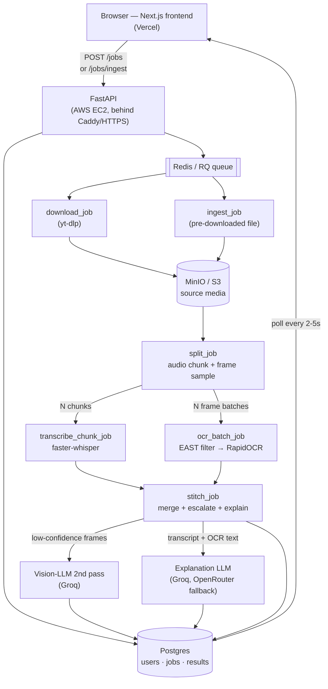
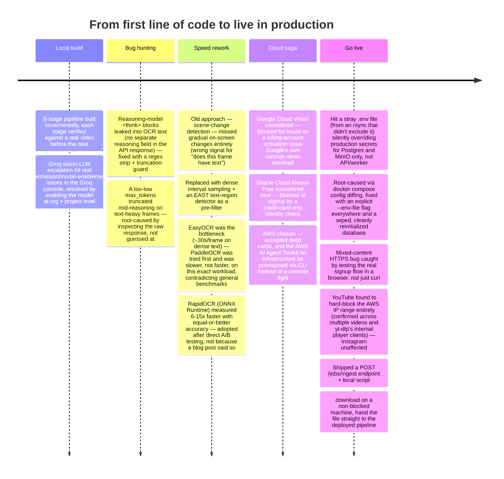

# Project Dossier — Universal Video Content Extraction Platform

A reference for explaining this project end-to-end: what it does, how it's built, how it's
deployed, what went wrong along the way, and how each problem was actually solved. Written in
Q&A form where that's the natural shape, narrative where it isn't.

---

## 1. The one-liner

> Paste any video URL (YouTube, Instagram, TikTok, X) and get back the spoken transcript,
> on-screen text, and metadata — one pipeline that works the same for a 30-second clip and a
> 45-minute long-form video, because short clips just collapse to a single chunk of it.

Built incrementally, 15 stages, each verified against a **real video**, not a mock, before
moving on. Fully deployed to production on AWS + Vercel, with a real signup and a real video
processed through the live UI as the final proof, not just a `curl /health`.

---

## 2. System architecture

**Why this shape:** every stage is an independent RQ job; `split_job` fans out N audio chunks
and N frame batches in parallel, and `stitch_job` only runs once *all* of them resolve — RQ's
`Dependency` primitive (a job that depends on a list of parent job IDs) covers this fan-out/
fan-in exactly, which is why Celery was never adopted: there was no missing primitive to
justify its extra operational surface (separate beat/flower processes, broker config) for a
single-broker, Redis-only setup.

---

## 3. Deployment — as an interviewer would ask it

**Q: Where does this actually run, and why there?**
Backend (Postgres, Redis, MinIO, API, worker) runs on a **free-tier AWS EC2 instance**
(`t4g.small`, ARM Graviton, `ap-south-1`) via a hardened `docker-compose.prod.yml`, behind
**Caddy** for automatic HTTPS. The frontend is on **Vercel** (best free tier specifically for
Next.js). Total infrastructure cost: **₹0** — the whole brief was "get this live with zero
budget," so every piece of the stack had to be a genuinely free tier, not a trial.

**Q: Why AWS and not something else?**
The original plan was **Oracle Cloud's Always Free tier** — genuinely free forever, and its
ARM instances offer up to 24GB RAM (vs AWS's 2GB on the free `t4g.small`), which matters
because the worker loads faster-whisper + RapidOCR + EAST models simultaneously. Oracle's
signup, however, requires a **credit card** specifically for identity verification — a debit
card was rejected, twice, on two different Oracle projects. AWS's signup accepts debit cards,
so the plan pivoted there instead. (Full detail in the challenges section below.)

**Q: How did you actually provision the server — click through the console?**
No — through the **AWS CLI**, authenticated via `aws login` (short-term, auto-rotating
credentials, not a long-lived access key), then scripted: found a free-tier-eligible instance
type (`t4g.small`), pulled the latest Ubuntu ARM64 AMI via SSM, created a security group
(SSH restricted to one IP, HTTP/HTTPS open), created a key pair, launched the instance, waited
for status checks, then `rsync`'d the code over and brought up the Docker Compose stack.
Every one of those steps is a single `aws ec2 ...` command — reproducible, not a one-off click
sequence. Full commands are in `DEPLOYMENT.md`.

**Q: How do you have HTTPS without paying for a domain?**
**[nip.io](https://nip.io)** — a free "magic domain" that resolves `<ip>.nip.io` to `<ip>`
automatically. It's a real, publicly resolvable DNS name with zero signup, so Caddy can get it
a genuine Let's Encrypt certificate immediately. No domain purchase needed for a project at
this stage.

**Q: How did the frontend get deployed?**
Via the Vercel CLI: `vercel login` (device-authorization flow — approve a URL in the browser,
no password ever touches the CLI), `vercel link`, set `NEXT_PUBLIC_API_URL` as an environment
variable, `vercel deploy --prod`.

**Q: Walk me through a bug you actually hit in this deployment.**
The frontend went live on HTTPS; the backend was still plain HTTP at that point. Signup
through the real UI failed with a generic error — but `curl`-ing the same endpoint worked
fine. The cause: browsers silently block an HTTPS page from calling a plain-HTTP API
("mixed content"), and `curl` doesn't enforce that policy, so the curl test gave false
confidence. Fixed by standing up Caddy/TLS *before* declaring the deployment done, and — the
real lesson — **verifying through the actual browser UI, not just an API client**, because
that's the only thing that reproduces what a real user experiences.

---

## 4. Challenges — chronological, with the actual fix

### The two that took the longest to actually solve

**Groq's daily token quota (200K tokens/day).** Repeatedly exhausted during testing (vision-LLM
escalation + the explanation feature both draw from the same pool). Real production risk, not
just a dev annoyance — flagged explicitly in the deployment docs. Mitigation used during
development: a free OpenRouter model as a same-night fallback, with the caveat that a smaller
free model produces occasional token-level corruption that a frontier model wouldn't.

**The Google Cloud → Oracle Cloud → AWS chain.** Three different cloud providers were
attempted before one actually worked, each blocked by something outside the code:
- **Google Cloud Vision**: a billing account stuck in a "suspended, needs appeal" state, then a
  second billing account stuck as an *unactivated free trial* — verified directly via both
  the Google Cloud CLI and live API calls (not assumed from the console UI, which looked fine),
  confirmed as a genuine account-level block only Google's own support flow could resolve.
- **Oracle Cloud Always Free**: rejected a debit card at the identity-verification step.
- **AWS**: accepted a debit card; the **AWS AI Agent Toolkit** (see below) then let the actual
  EC2/security-group/key-pair provisioning happen via scripted CLI calls instead of a manual
  console click-through — directly avoiding a repeat of the friction from the first two.

---

## 5. Security measures actually implemented

| Layer | What's in place |
|---|---|
| **Auth** | JWT (HS256) issued on login/signup; passwords hashed with bcrypt, never stored or logged in plaintext |
| **Rate limiting** | Redis-backed (`slowapi`) on `/auth/login` (10/min), `/auth/signup` (5/min), and `POST /jobs` (10/hour) — verified live: the 11th rapid login attempt actually returned `429`, not just configured and assumed working |
| **Authorization** | Every job lookup checks `job.user_id == current_user.id` — a job ID alone doesn't grant access; confirmed directly by requesting another account's job and getting `404`, not `403` (no confirmation to an attacker that the ID even exists) |
| **Network exposure** | Postgres, Redis, and MinIO are **not** publicly reachable — no port mappings in the production compose file, only reachable inside the Docker network. SSH restricted to one IP via the security group; only 80/443 open to the world |
| **Transport** | HTTPS end-to-end via Caddy + Let's Encrypt (auto-renewing); CORS locked to the exact deployed frontend origin, not a wildcard |
| **Secrets** | Generated with `secrets.token_urlsafe()` directly on the server, never reused from anything pasted into a chat or doc; `.env.production` is gitignored; a stray copy of the *dev* `.env` accidentally reaching the server was the actual root cause of one real incident (below) |
| **Credential handling for deployment** | AWS access uses `aws login`'s short-term, auto-rotating credentials (refresh every 15 min, expire within 12 hours) instead of a long-lived access key that never expires and sits on disk as plaintext |

**A real incident, not a hypothetical:** an `rsync` that forgot to exclude the local dev `.env`
left it sitting on the production server next to `.env.production`. Docker Compose auto-loads
a file literally named `.env` for its own `${VAR}` interpolation — separate from `env_file:`,
which only injects variables into a container's runtime. That meant Postgres and MinIO silently
initialized with the *dev* file's default credentials, while the API/worker still connected
using the real production secrets (loaded correctly via `env_file:`) — a mismatch that surfaced
as `InvalidAccessKeyId` on MinIO specifically. Root-caused by diffing `docker compose config`
output line-by-line against what was expected, not by guessing. Fixed by deleting the stray
file, always passing `--env-file .env.production` explicitly, and wiping the two volumes that
had initialized wrong before reinitializing cleanly.

---

## 6. The AWS AI Agent Toolkit — what it is and what it actually did here

**What it is:** an official Anthropic/AWS-published Claude Code plugin
(`aws-core@claude-plugins-official`) that bundles two things:
1. An **MCP server** giving an agent direct, authenticated access to AWS APIs (all AWS
   services, through one endpoint) plus a sandboxed script-execution environment.
2. A set of **skills** — curated, verified instructions for specific AWS tasks (IAM, EC2,
   serverless, containers, CDK/CloudFormation, secrets, sign-in) that the agent loads only
   when the task actually matches, rather than acting from general/possibly-stale training
   knowledge.

**Why it was reached for:** after the Google Cloud and Oracle Cloud attempts both stalled on
console-driven account/billing flows that were slow to diagnose and impossible to script, the
goal was to avoid a third repeat of that pattern — get infrastructure provisioning to be
**API-driven and reproducible** instead of manual and opaque.

**How it was actually installed and used:**
- Installed via the Claude Code CLI directly: `claude plugin install aws-core@claude-plugins-official`
  (a plugin marketplace install, not a console click).
- The bundled `signing-in-to-aws` skill was invoked specifically for auth — its documented,
  correct recommendation is `aws login` over a static access key, precisely *because* it's
  short-term and auto-rotating rather than a plaintext secret that never expires. That
  distinction was surfaced by the skill itself, not decided ad hoc.
- Once real AWS credentials existed, EC2 provisioning happened as a sequence of scripted CLI
  calls (`describe-instance-types`, `ssm get-parameter` for the AMI, `create-security-group`,
  `authorize-security-group-ingress`, `create-key-pair`, `run-instances`, `wait
  instance-status-ok`) — each one auditable, rerunnable, and diffable, unlike a remembered
  sequence of console screens.

**What it solved, concretely:** the entire EC2 + networking + Docker deployment for this
project was stood up without a single manual console click on AWS's side — every step is a
command in `DEPLOYMENT.md` that can be re-run against a fresh account. That reproducibility is
the direct answer to what went wrong with Google Cloud and Oracle Cloud, where the actual
blocker (a stuck billing account, a rejected card) was invisible from outside the console and
took real back-and-forth to even diagnose.

---

## 7. Key technical decisions and why

| Decision | Alternative considered | Why this one |
|---|---|---|
| RQ for the job queue | Celery | Fan-out/fan-in fully covered by RQ's `Dependency` primitive; Celery's extra operational surface (beat, flower, broker config) wasn't justified for a single-broker Redis setup |
| RapidOCR (ONNX Runtime) | EasyOCR (original), PaddleOCR | Measured, not assumed: EasyOCR was ~30s/frame on dense text; PaddleOCR was tested and was *slower* on this exact workload despite general benchmarks suggesting otherwise; RapidOCR measured 6-15x faster with equal-or-better accuracy |
| EAST text-region detector as a frame pre-filter | Scene-change detection (ffmpeg) | Scene-change is the wrong signal for "does this frame have text" — gradual scrolling/typing never trips a scene-change threshold, so genuinely informative frames were being skipped entirely |
| nip.io + Caddy for HTTPS | Buying a domain | Zero-cost constraint; nip.io is a real, resolvable DNS name, so Let's Encrypt issues a genuine certificate against it |
| `aws login` over a static access key | IAM access key + secret in `~/.aws/credentials` | Short-lived and auto-rotating vs. a plaintext credential that never expires and grants indefinite access if leaked |
| `POST /jobs/ingest` as a second ingestion path | Proxying all traffic through a residential VPN/proxy | Free, no third-party dependency, and directly addresses the actual failure mode (server IP blocked) rather than trying to disguise the server's traffic |

---

## 8. Results, verified end-to-end (not just claimed)

- A **45-minute** long-form video processed fully through the pipeline in production.
- A **10-12 minute** YouTube video — blocked entirely at the platform level from the AWS IP —
  successfully processed via the `/jobs/ingest` workaround, verified with a real job reaching
  `done` status with transcript, OCR, and explanation all populated.
- OCR engine swap measured **6-15x faster** (RapidOCR vs. the original EasyOCR) on real dense
  technical-content frames (code editors, terminals), not synthetic benchmark images.
- Real signup and login flow verified **through the actual deployed browser UI** on production,
  not just via API calls — which is what caught the mixed-content HTTPS bug that curl testing
  had missed.

---

## 9. Likely follow-up questions

**"What would you do differently with more budget?"**
Move off Groq's shared 200K-token/day free tier onto a paid tier or a dedicated model instance
before real user growth — it was the single most frequently hit ceiling during both development
and early production use. Also add off-instance backups for Postgres/MinIO, currently accepted
as a risk at hobby scale.

**"How would this scale to more concurrent users?"**
The worker is currently a single process; `docker compose ... up -d --scale worker=N` covers
horizontal scaling for CPU-bound transcription/OCR without any code changes, since jobs are
already fully decoupled via the RQ queue.

**"What's the biggest architectural risk you're carrying?"**
Platform blocking at scale generally — the YouTube-on-AWS-IP case has a concrete workaround
now, but Instagram/TikTok/etc. blocking under real production volume (rather than the light
testing done here) is still an open risk, explicitly flagged rather than silently ignored.
